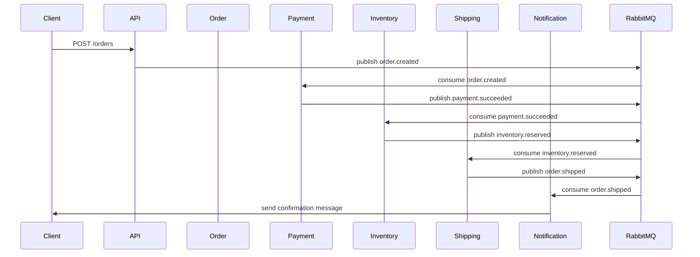

# אפיון שירותים - E-Commerce Event-Driven System (RabbitMQ)

מסמך זה מפרט את האפיון של כל אחד מהשירותים במערכת המסחר האלקטרוני, המבוססת על ארכיטקטורת **Microservices** ותקשורת **Event-Driven** באמצעות **RabbitMQ**.

---

## 🧩 1. API Gateway (FastAPI)

### מטרות
- לשמש כנקודת הכניסה היחידה (Entry Point) למערכת.
- לאפשר יצירה, שליפה וניהול של הזמנות ע"י הלקוח או ה-Frontend.
- לנתב בקשות לשירותים הרלוונטיים ולהחזיר תגובות אחידות.

### Endpoints עיקריים
| מתודה | נתיב | תיאור |
|--------|------|--------|
| `POST /orders` | יצירת הזמנה חדשה. שולחת אירוע `order.created` ל-RabbitMQ |
| `GET /orders/{order_id}` | שליפת פרטי הזמנה לפי מזהה |
| `GET /orders` | החזרת כל ההזמנות (למטרת Dashboard) |

### אינטגרציה
- מתחבר ל-`Order Service` ליצירה ושליפה של הזמנות.
- מפרסם הודעות ל־`order.exchange` ב-RabbitMQ.
- מאזין להודעות עדכון סטטוס ממיקרו־שירותים אחרים.

### דוגמה למבנה הודעת order.created
```json
{
  "order_id": "12345",
  "user_id": "u-001",
  "items": [{"product_id": "p-100", "quantity": 2}],
  "total": 299.90,
  "status": "created"
}
```

---

## 📦 2. Order Service

### מטרות
- לנהל את מחזור החיים של ההזמנה (Order Lifecycle).
- לשמור נתוני הזמנה במסד נתונים (MongoDB).
- לפרסם אירועים לשירותים אחרים לפי סטטוס.

### מבנה מסד הנתונים (MongoDB)
```json
{
  "_id": "ObjectId",
  "order_id": "12345",
  "user_id": "u-001",
  "items": [{"product_id": "p-100", "quantity": 2}],
  "status": "created",
  "created_at": "2025-10-01T10:00:00Z"
}
```

### אירועים עיקריים
- `order.created` — כאשר נוצרה הזמנה חדשה.
- `order.updated` — כאשר סטטוס ההזמנה מתעדכן.
- `order.completed` — כאשר ההזמנה הושלמה בהצלחה.

### תקשורת RabbitMQ
- Exchange: `order.exchange` (סוג: topic)
- Queue: `order.created.queue`

---

## 💳 3. Payment Service

### מטרות
- לצרוך אירועים מסוג `order.created`.
- לבצע תהליך תשלום (סימולציה) ולפרסם תוצאה.

### לוגיקה עיקרית
1. מאזין ל־`order.created` queue.
2. מנסה לחייב את המשתמש (בדיקה רנדומלית או API מדומה).
3. במקרה הצלחה → שולח `payment.succeeded`.
4. במקרה כישלון → שולח `payment.failed`.

### דוגמה להודעת payment.succeeded
```json
{
  "order_id": "12345",
  "transaction_id": "tx-6789",
  "amount": 299.90,
  "status": "succeeded"
}
```

### תקשורת RabbitMQ
- Consumes: `order.created`
- Publishes: `payment.succeeded`, `payment.failed`
- DLQ: `payment.dlq` (במקרה של כשל מתמשך)

---

## 🏪 4. Inventory Service

### מטרות
- לנהל את זמינות המוצרים.
- להפחית מלאי במקרה של תשלום מוצלח.
- להחזיר מלאי במקרה של ביטול או כישלון תשלום.

### לוגיקה עיקרית
1. צורך `order.created` כדי לשריין מלאי.
2. צורך `payment.succeeded` כדי להפחית מלאי בפועל.
3. מפרסם `inventory.reserved` או `inventory.failed`.

### דוגמה להודעת inventory.reserved
```json
{
  "order_id": "12345",
  "reserved_items": [{"product_id": "p-100", "quantity": 2}],
  "status": "reserved"
}
```

### תקשורת RabbitMQ
- Consumes: `order.created`, `payment.succeeded`
- Publishes: `inventory.reserved`, `inventory.failed`

---

## 🚚 5. Shipping / Fulfillment Service

### מטרות
- לטפל במשלוח פיזי של המוצר לאחר הצלחת תשלום ומלאי.
- לעדכן את סטטוס ההזמנה ל־"shipped".

### לוגיקה עיקרית
1. צורך `inventory.reserved`.
2. מעבד את בקשת המשלוח (מדומה).
3. מפרסם `order.shipped`.

### דוגמה להודעת order.shipped
```json
{
  "order_id": "12345",
  "tracking_number": "TRK123456",
  "status": "shipped"
}
```

---

## 📢 6. Notification Service

### מטרות
- לשלוח הודעות ללקוח על שינויי סטטוס בהזמנה.
- נשלחות הודעות במייל או הודעות Push (סימולציה).

### אירועים מאזינים
- `payment.succeeded`
- `order.shipped`
- `payment.failed`

### דוגמה להודעת Notification
```json
{
  "user_id": "u-001",
  "message": "התשלום עבור ההזמנה שלך הושלם בהצלחה!",
  "type": "email"
}
```

---

## ⚙️ 7. Workers

### מטרות
- לטפל בעיבודים כבדים או משימות רקע.
- לתמוך במנגנוני Retry, Delay ו-Backoff.

### שימושים אפשריים
- עיבוד חוזר של הזמנות כושלות.
- בדיקת תקינות תשלומים.
- ניקוי תורים ישנים או DLQ.

---

## 📊 תרשים רצף בסיסי (Sequence Flow)



---

## ✅ סיכום

מערכת זו מציגה זרימת עבודה מבוססת אירועים, עם תקשורת מבוזרת, תורים, retries ו-DLQ, תוך שימוש ב-RabbitMQ, FastAPI, MongoDB ו-React.  
הפרויקט מתאים ללמידה מעשית של Event-Driven Architecture ויישום מיקרו-שירותים אמיתיים.


